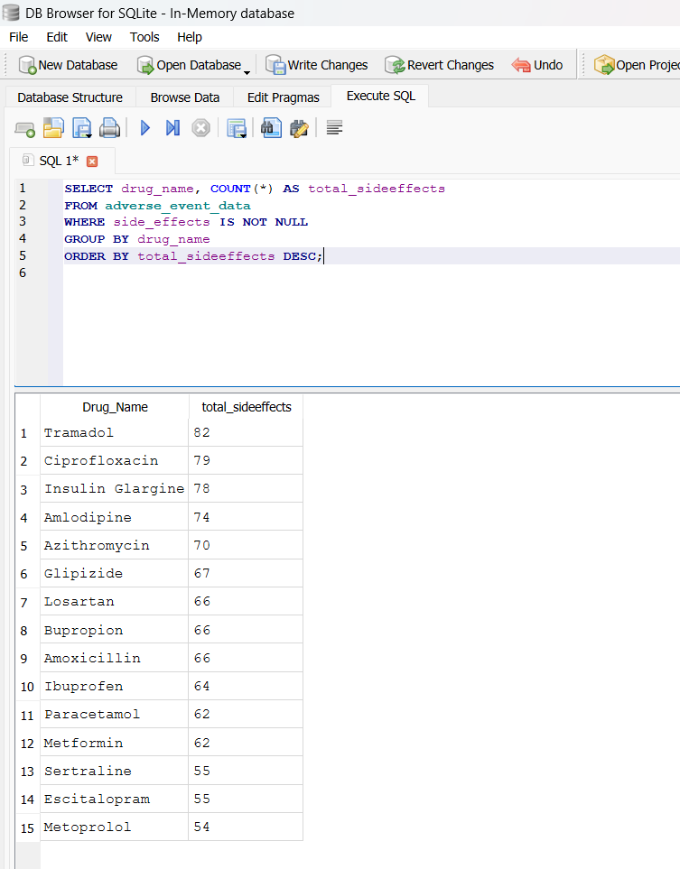
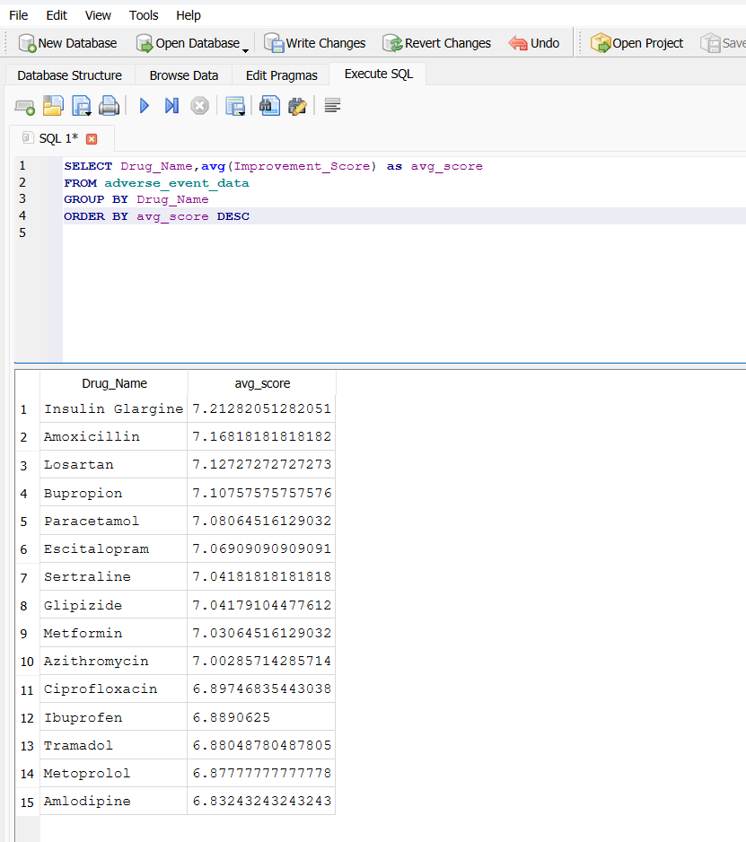
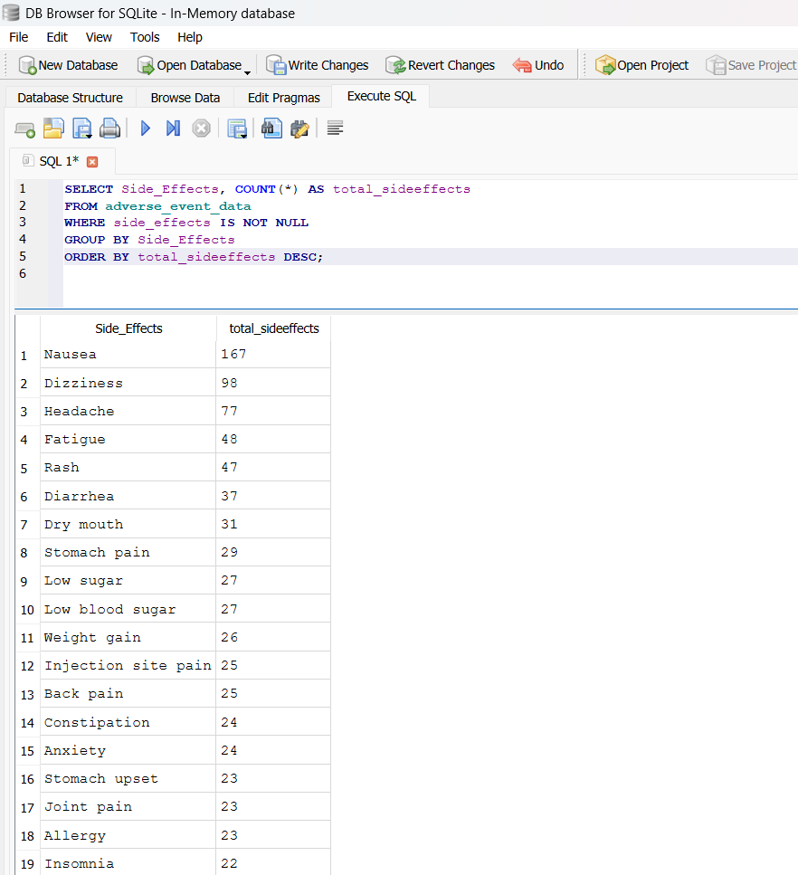
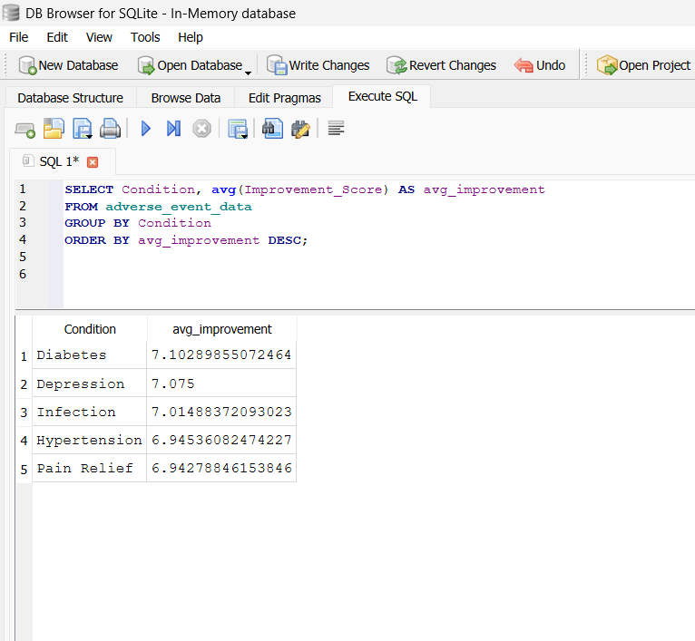
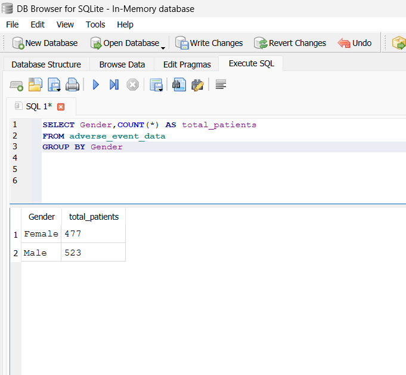
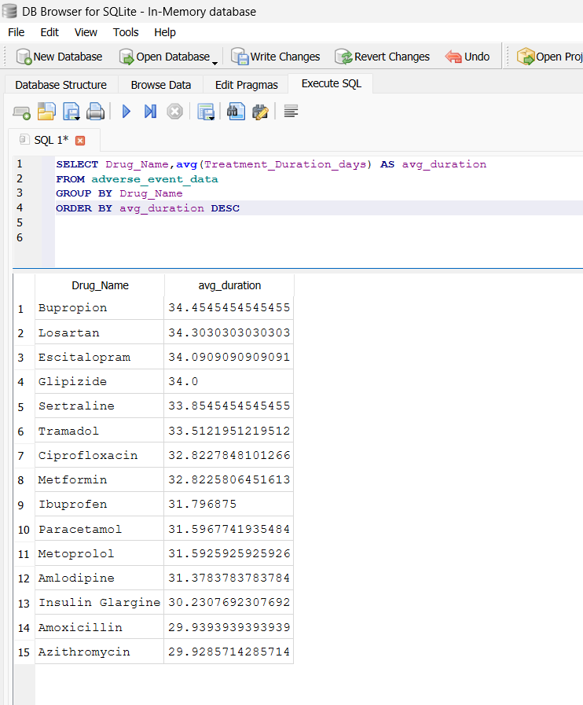
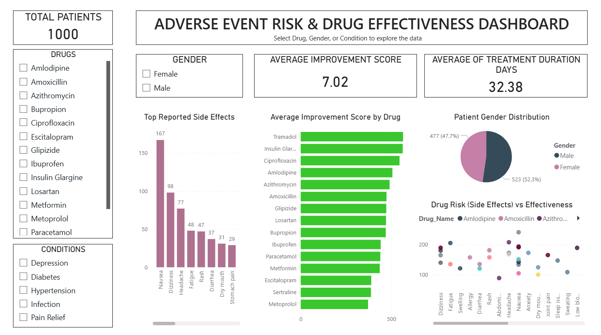

# Adverse Event Risk & Drug Effectiveness Analysis

## Project Overview

This project analyzes clinical patient data to evaluate drug effectiveness and adverse event (side effect) risk.
The goal is to identify safer and more effective drugs using data-driven techniques.

The project follows an end-to-end workflow including data cleaning, SQL analysis, and Power BI visualization.

## Tools & Technologies Used

- Excel → Data Cleaning

- SQL → Data Analysis

- Power BI → Data Visualization

## Dataset Description

The dataset includes the following fields:

- Patient ID

- Age

- Gender

- Medical Condition

- Drug Name

- Dosage

- Treatment Duration

- Side Effects

- Improvement Score

## Project Workflow

### 1. Data Cleaning (Excel)

- Removed duplicate records

- Handled missing values

- Standardized column names for consistency

### 2. Data Analysis (SQL)

- Performed analysis using SQL queries to extract meaningful insights:

- Identified drugs with the highest side effects

- Calculated average improvement score per drug

- Found most common side effects

- Compared treatment effectiveness across conditions

- Analyzed patient distribution by gender

- Evaluated treatment duration across drugs

## SQL Analysis Results

### Drug Side Effects Analysis

### Drug Effectiveness Analysis

### Side Effects Frequency

### Condition Effectiveness

### Gender Distribution

### Treatment Duration

### 3. Data Visualization (Power BI)

- Developed an interactive dashboard to visualize:

- Drug effectiveness comparison

- Side effect distribution

- Risk vs effectiveness analysis

- Patient demographics

## Dashboard Preview

## Key Insights

- Certain drugs show high effectiveness with fewer side effects, making them safer treatment options

- Some drugs exhibit higher side effect frequency, indicating increased risk

- A balance between drug effectiveness and safety is crucial in treatment decisions

- Common side effects include nausea and dizziness

- Patient distribution is relatively balanced across gender

- Treatment duration varies across drugs, indicating differences in therapy length

## Conclusion

This analysis helps in identifying:

- Safer and more effective drugs

- High-risk drugs requiring monitoring

- Data-driven insights to support clinical decision-making

